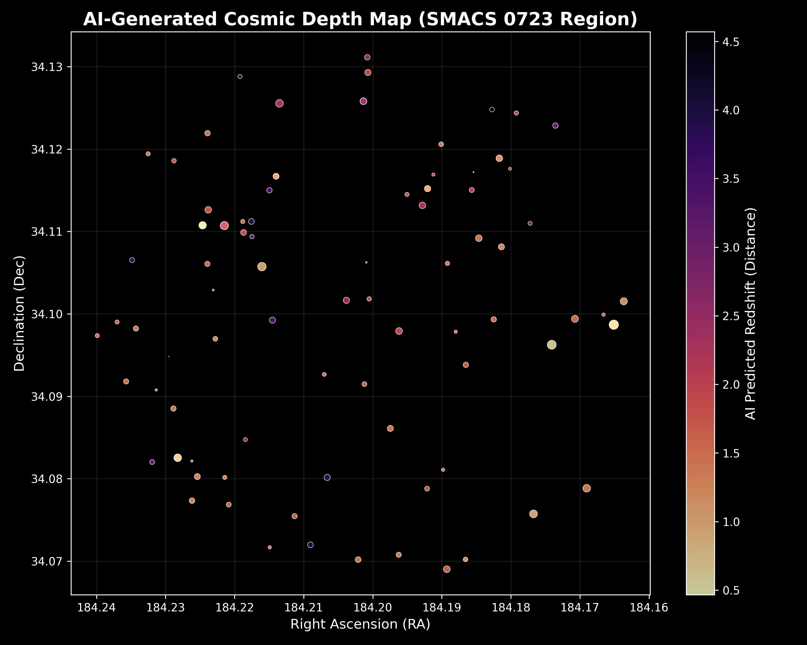

# 🔭 Deep Space 3D Observatory



Welcome to the **Deep Space 3D Observatory**! This project is an end-to-end Deep Learning pipeline that takes standard 2D space imagery coordinates and transforms them into a fully interactive 3D cosmological map.

Built for the **Built with Python Hackathon**, this tool seamlessly integrates live astronomical data mining, neural network inference, and 3D graphics rendering to bring the universe to your screen.

## 🌟 Features

- **Automated Data Mining**: Connects directly to the Sloan Digital Sky Survey (SDSS) and VizieR APASS databases to fetch multi-band photometry (`u, g, r, i, z` filters) based on Right Ascension (RA) and Declination (Dec).
- **AI Redshift Prediction**: Uses a custom PyTorch Multi-Layer Perceptron (MLP), trained on over 700k quasars, to instantly predict the cosmological distance (redshift) of galaxies from their photometric colors.
- **Interactive 3D Engine**: Uses Pygame to plot the inferred depths of thousands of celestial objects into an interactive, rotatable, and zoomable 3D environment.
- **Batch Pipeline**: Features an automated workflow that runs inference on a curated list of famous deep fields (e.g., James Webb SMACS, Hubble Deep Field, Swan Nebula).

## 🚀 Quick Start

### 1. Install Dependencies
Ensure you have Python 3 installed. Then, install the required packages:
```bash
pip install -r requirements.txt
```

### 2. Run the Observatory
Launch the full automated batch pipeline using the provided shell script:
```bash
./run.sh
```
Or run the Python script directly:
```bash
python main.py
```

### 3. Using Your Own Images
The pipeline comes pre-configured with several famous deep-space fields. To look at *your own* image:
1. Find the **Right Ascension (RA)** and **Declination (Dec)** of your image (often found on NASA/Wikipedia pages).
2. Convert them to **Decimal Degrees**.
3. Open `main.py` and add your coordinates to the `SPACE_IMAGES` array.
4. Run the script and explore your image in 3D!

## 📂 Repository Structure

- `main.py` - The primary entry point and batch orchestrator.
- `run.sh` - Simple execution script.
- `scripts/data_miner.py` - Connects to SDSS/VizieR to pull raw photometric telemetry.
- `scripts/process_deep_field.py` - Loads the AI models, processes the telemetry, and generates the 2D Matplotlib depth map.
- `scripts/pygame_3d_observatory.py` - The Pygame 3D rendering engine.
- `models/` - Contains the trained PyTorch `.pth` models and Scikit-Learn scalers.

## 🧠 Under the Hood
The core AI model (`PhotoZNet`) is a PyTorch neural network that analyzes subtle variations in 5 distinct color bands (`u, g, r, i, z`). By comparing these ratios, the network can calculate the redshift of a galaxy—meaning how fast it is moving away from us due to the expansion of the universe—which gives us its distance.

## 📜 License
MIT License. Feel free to explore, fork, and map the universe!
