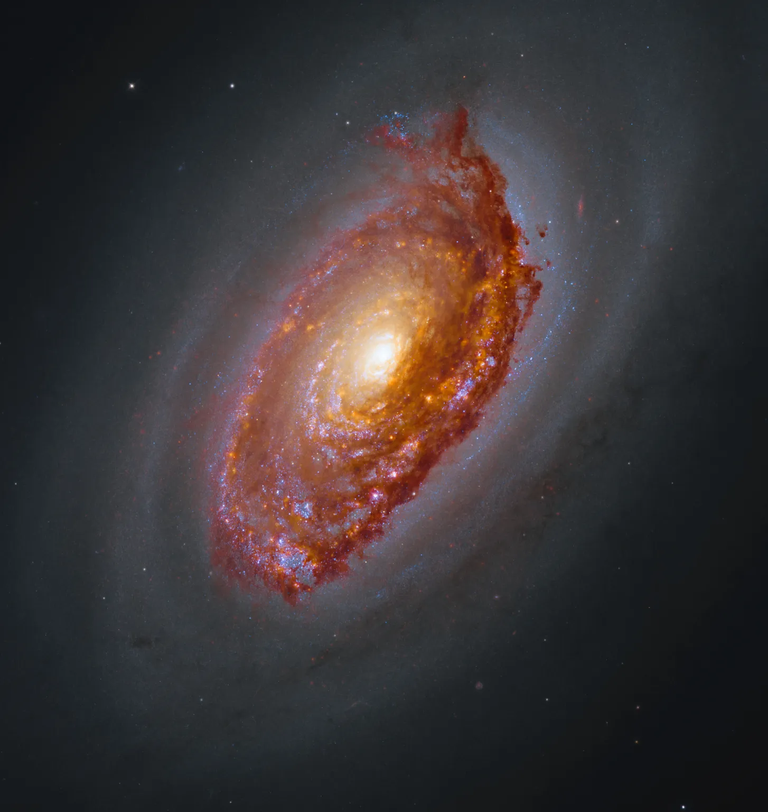

# 🔭 Deep Space 3D Observatory

<p align="center">
  
  &nbsp;&nbsp;&nbsp;&nbsp;
  
</p>

Welcome to the **Deep Space 3D Observatory**! This project is an end-to-end Deep Learning pipeline that takes standard 2D space imagery coordinates and transforms them into a fully interactive 3D cosmological map.

Built for the **Built with Python Hackathon**, this tool seamlessly integrates live astronomical data mining, neural network inference, and 3D graphics rendering to bring the universe to your screen.

## 🌟 Features

- **Automated Data Mining**: Connects directly to the Sloan Digital Sky Survey (SDSS) and VizieR APASS databases to fetch multi-band photometry (`u, g, r, i, z` filters) based on Right Ascension (RA) and Declination (Dec).
- **AI Redshift Prediction**: Uses a custom PyTorch Multi-Layer Perceptron (MLP), trained on over 700k quasars, to instantly predict the cosmological distance (redshift) of galaxies from their photometric colors.
- **Interactive 3D Engine**: Uses Pygame to plot the inferred depths of thousands of celestial objects into an interactive, rotatable, and zoomable 3D environment.
- **Batch Pipeline**: Features an automated workflow that runs inference on a curated list of famous deep fields (e.g., James Webb SMACS, Hubble Deep Field, Swan Nebula).
- **Web API**: Includes a complete FastAPI Hugging Face Space deployment for easy web inference.

## 🚀 Quick Start

### 1. Install Dependencies
Ensure you have Python 3 installed. Then, install the required packages:
```bash
pip install -r requirements.txt
```

### 2. Run the Observatory
Launch the full automated batch pipeline using the provided shell script:
```bash
./run.sh
```
Or run the Python script directly:
```bash
python main.py
```

### 3. Using Your Own Images
The pipeline comes pre-configured with several famous deep-space fields. To look at *your own* image:
1. Find the **Right Ascension (RA)** and **Declination (Dec)** of your image (often found on NASA/Wikipedia pages).
2. Convert them to **Decimal Degrees**.
3. Open `main.py` and add your coordinates to the `SPACE_IMAGES` array.
4. Run the script and explore your image in 3D!

## 📂 Repository Structure

- `main.py` - The primary entry point and batch orchestrator.
- `run.sh` - Simple execution script.
- `scripts/data_miner.py` - Connects to SDSS/VizieR to pull raw photometric telemetry.
- `scripts/process_deep_field.py` - Loads the AI models, processes the telemetry, and generates the 2D Matplotlib depth map.
- `scripts/pygame_3d_observatory.py` - The Pygame 3D rendering engine.
- `models/` - Contains the trained PyTorch `.pth` models and Scikit-Learn scalers.
- `server/` - Production-ready FastAPI web server for Hugging Face Spaces.

## 🧠 Under the Hood
The core AI model (`PhotoZNet`) is a PyTorch neural network that analyzes subtle variations in 5 distinct color bands (`u, g, r, i, z`). By comparing these ratios, the network can calculate the redshift of a galaxy—meaning how fast it is moving away from us due to the expansion of the universe—which gives us its distance.

## 💡 Inspiration
Looking at stunning images from the James Webb Space Telescope and Hubble, we often forget that space isn't flat—it's a vast, three-dimensional expanse. We were inspired to bridge the gap between flat 2D astrophotography and the true 3D reality of the cosmos. We wanted to make cosmology accessible and visually breathtaking, allowing anyone to literally "step into" their favorite deep space images and see the universe as it truly is.

## ⚙️ What it does
**AI Cosmic Observatory** is an end-to-end deep learning pipeline that transforms standard 2D space imagery coordinates into fully interactive 3D cosmological maps. You simply provide the Right Ascension (RA) and Declination (Dec) coordinates of a space image, and the observatory automatically mines live photometric data from astronomical databases. It then uses a custom AI model to predict the distance (redshift) of every galaxy and celestial object in that field, rendering them in an interactive, rotatable, and zoomable 3D environment. The automated batch pipeline processes multiple iconic space fields and gives separate files for the cosmic depth map individual images in the loop!

## 🛠️ How we built it
We built the data ingestion engine using Python to automatically query the Sloan Digital Sky Survey (SDSS) and VizieR APASS databases, fetching multi-band photometry (`u, g, r, i, z` filters). For the AI core, we developed and trained a custom PyTorch Multi-Layer Perceptron (MLP) on a dataset of over 700,000 quasars. This model learns the complex relationship between photometric color ratios and cosmological redshift. Finally, we built a custom 3D rendering engine using Pygame to plot these inferred depths, turning tabular AI predictions into a smooth, interactive visual experience. We also built a production-grade FastAPI web deployment.

## 🚧 Challenges we ran into
- **Data Acquisition & Cleaning:** Handling missing data, differing coordinate epochs (J2000), and rate-limiting from live astronomical databases was a significant hurdle.
- **Model Accuracy:** Translating raw photometric colors into accurate redshift estimations is highly non-linear. We had to experiment extensively with our PyTorch architecture, learning rate scheduling, and data normalization to achieve a high degree of precision.
- **3D Rendering Optimization:** Mapping potentially thousands of celestial objects in real-time within Pygame required optimizing our matrix transformations and projection math to maintain a smooth framerate.

## 🏆 Accomplishments that we're proud of
- Successfully training a high-precision deep learning model from scratch that genuinely understands cosmological redshift.
- Automating the complex workflow: from simply inputting coordinates to live data mining, AI inference, and 3D rendering.
- Creating a robust batch processing loop that not only renders the 3D space but also saves separate cosmic depth map files for each individual image processed.
- Deploying a beautiful, interactive web API via Hugging Face Spaces and FastAPI.

## 📚 What we learned
We gained deep, practical experience in integrating multiple complex systems: interacting with REST APIs for astronomical data, architecting and tuning PyTorch neural networks for regression tasks, and building computer graphics projection systems from the ground up using Pygame. We also learned a lot about astrophysics, specifically photometry and the expansion of the universe!

## 🔮 What's next for AI Cosmic Observatory
- **Web Deployment:** Porting the Pygame 3D rendering to WebGL/Three.js so anyone can explore the universe directly in their browser.
- **Enhanced AI Models:** Integrating Transformer-based architectures and exploring exoplanet detection capabilities from spectral data.
- **VR Integration:** Allowing users to put on a VR headset and literally float through the Hubble Deep Field in virtual reality!

## 📜 License
MIT License. Feel free to explore, fork, and map the universe!
